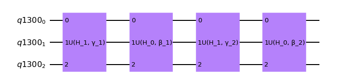
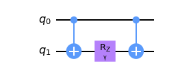
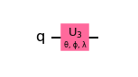

# Adiabatic quantum Simulation - Prototype Benchmark Program

Adiabatic Quantum Computation (AQC) is a different model of quantum computation. It is based on the adiabatic approximation [[1]](#reference):

> For a system initially prepared in an eigenstate (e.g., the ground state) $\left|\epsilon_0(0)\right\rangle$ of a time-dependent Hamiltonian $H(t)$, the time evolution governed by the Schrödinger equation $i\frac{\partial\left|\psi(t)\right\rangle}{\partial t} = H(t)\left|\psi(t)\right\rangle$ (we set $\hbar=1$ from now on) will approximately keep the actual state $\left|\psi(t)\right\rangle$ of the system in the corresponding instantaneous ground state (or other eigenstate) $\left|\epsilon_0(t)\right\rangle$ of $H(t)$, provided that $H(t)$ varies “sufficiently slowly”.

One way to construct the time dependent Hamiltonian $H(t)$ is by interpolation of the initial Hamiltonian $H_0$ and final Hamiltonians $H_f$
$
H(t) = \bar{\beta}(t)H_0 + \bar{\gamma}(t) H_f,
$
where $\bar{\beta}(t)$ and $\bar{\gamma}(t)$ are monotonically decreasing and increasing, respectively, and $\bar{\beta}(0)=1$, $\bar{\beta}(t_f)=0$, $\bar{\gamma}(0)=0$, $\bar{\gamma}(t_f)=1$.

## Problem outline
In this benchmark, we are interested in using quantum circuit to model AQC. In particular, we shall choose the initial Hamiltonian to be tensor product of Pauli X operators
$
H_0=\prod_{i=1}^nX_i
$
where there are $n$ qubits in the system, and the final Hamiltonian to be a 1D Ising model with open boundary condition
$
H_f=J\sum_{i=0}^{n-1}Z_iZ_{i+1} + \sum_{i=1}^nZ_i
$

## Benchmarking
This is the same as in [hamiltonian-simulation](../hamiltonian-simulation/)

## Classical algorithm
This is the same as in [hamiltonian-simulation](../hamiltonian-simulation/)

## Quantum algorithm

Since $H(t)$ is time-dependent, the method used in [hamiltonian-simulation](../hamiltonian-simulation/) does not apply because the evolution operator is a time-ordered operator in this case. First, let us discretize the time window $[0,t_f]$ into $p$ pieces, and define 
$
t_i=i\frac{t_f}{p}, \quad, i=0, ..., p
$
such that we can approximate the dynamics as governed by $p+1$ time-independent Hamiltonians 
$
H_i\equiv H(t_i) = \bar{\beta}(t_i)H_0 + \bar{\gamma}(t_i)H_f 
$
The evolution operator reads
$
U(t_f) \approx \prod_{i=1}^p\exp(-iH_i(t_i-t_{i-1})) = \prod_{i=1}^p\exp\left\{-i\frac{t_f}{p}(\bar{\beta}(t_i)H_0 + \bar{\gamma}(t_i)H_f)\right\}\\
\approx\prod_{i=1}^p\exp\left\{-i\frac{t_f}{p}\bar{\gamma}(t_i)H_f\right\}\exp\left\{-i\frac{t_f}{p}\bar{\beta}(t_i) H_0\right\}
$
where the approximation in the last line is correct up to $O(1/p^2)$. Thus the AQC is a good approximation for large $p$, as it should be. For the convenience of this benchmark, we further assume that 
$
\beta_i\equiv\frac{t_f}{p}\bar{\beta}(t_i)=1-\frac{i}{p}, \quad
\gamma_i\equiv\frac{t_f}{p}\bar{\gamma}(t_i)=\frac{i}{p}
$
such that
$
U(t_f) 
\approx\prod_{i=1}^p\exp\left\{-i\gamma_iH_1\right\}\exp\left\{-i\beta_i H_0\right\} = \prod_{i=1}^pU(H_1, \gamma_i)U(H_0, \beta_i)
$
which is ready to be implemented on a quantum circuit.

### General Quantum Circuit

   

*Fig 1. Example of ACQ circuit for 3 qubits with $p=2$. For the implementation of , see below*

### Algorithm Steps

1. Initialize qubits in all superposition state $|\psi_0\rangle = \sum_i|+_i\rangle$

2. Build the layers for $U(H_0,\beta)$ and $U(H_1,\gamma)$.

3. Apply the two layers for a given $p$. 

4. Measure out all of the qubits

## Gate Implementation

We shall implement two kinds of gates

- **The two-qubit rotation:** There is only one type of two-qubit rotation involved in this benchmark, namely $e^{i\gamma ZZ}$. To implement this kind of the gate, we simply use the following circuit

   

- **The single-qubit rotation:** Single qubit rotations are involved in both $U(H_1,\gamma)$ and $U(H_0, \beta)$, which are $e^{i\gamma Z}$ and $e^{i\beta X}$ respectively. We can combine these two gates, and implement the $U_3(\theta, \phi, \lambda)$ gate as following, where
$
\theta = \beta, \quad \phi = -\pi/2, \quad \lambda = \gamma-\pi/2
$

   

In summary, in the layer of $U(H_1, \gamma)$, we shall implement just the two qubit rotation parts of $H_1$, and in $U(H_0, \beta)$, we shall implement the single qubit rotation part of $H_1$ and $H_0$. 

## References

[1] Tameem Albash and Daniel A. Lidar. (2018).
    Adiabatic quantum computation
    [`DOI:https://doi.org/10.1103/RevModPhys.90.015002`](https://journals.aps.org/rmp/abstract/10.1103/RevModPhys.90.015002)

[//]: # (Below are some thoughts that went into the choice of the type of hamiltonian simulation to be used for this benchmark.)

[//]: # (Nearest-neighbor 1D, 2D and 3D cases are all physically motivated, corresponding to say, a nanowire, a thin film, and a cubic crystal. In this case, 1D is a suitable benchmark for current quantum computers since it has the least number of gates. As quantum computers improve, the simulation benchmarks could be designed to include higher dimensions.)

[//]: # (If interactions between all pairs of spins were to be added, it would correspond to a limit of the long-range Heisenberg model. There are studies on this, but it may not show the localization behavior being captured in the accuracy metric in the benchmark. For this reason, the benchmark was written for the 1D case only.)

[//]: # (The bodies being simulated can be represented as a linear chain of bodies, i.e. a 'open boundary condition' or in a circle, i.e. a 'periodic boundary condition'. In the limit of large system size, the boundary will not affect the bulk physics represented here. For small system sizes, periodic boundaries have some advantage in that they are less susceptible to 'edge effects', and the system can be Fourier transformed and studied in momentum space. Their drawback is that some numerical approximation techniques work poorly. In other simulation studies such as those of topological phenomena, there is important physics corresponding to a 'bulk-boundary correspondence', and the open edge is purposefully introduced.)

[//]: # (Therefore, the choice of boundary condition depends on the system being studied and the computational technique being employed. Here it does not matter too much.)