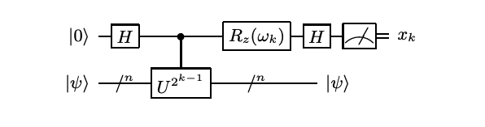

# Iterative quantum phase estimation - Benchmark Program

The iteractive quantum phase estimation (IQPE) [[1]](#references) is an algorithm that requires only a single ancilla qubit and estimate the phase through a repetitive process.

## Problem outline

The problem that IQPE solves is similar to the one for [Quantum phase estimation (QPE)](../phase-estimation/). In particular, the goal of IQPE is to to estimate the phases of the eigenvalues of a unitary operator $U$
$
U|\psi\rangle = e^{i2\pi\phi}|\psi\rangle
$
where $|\psi\rangle$ is an eigenvector with $e^{i2\pi\phi}$ as the corresponding eigenvalue for $U$.

## Benchmarking
The IQPE algorithm is benchmarked by running `max_circuits` circuits for a randomly constructed $\phi=\sum_{i=1}^m\phi_i2^{-i}$ where $\phi_i=0,1$ chosen randomly, and $m=$`max_circuits`. Each circuit is repeated a number of times denoted by `num_shots`. We then run the algorithm circuit for numbers of qubits between `min_qubits` and `max_qubits`, inclusive. The test returns the averages of the circuit creation times, average execution times, fidelities, and circuit depths, like all of the other algorithms. For this algorithm's fidelity calculation, because we chose $\phi$ to never require more precision than the number of counting qubits can provide, we compare the returned measurements against the distribution that has the single state with 100% probability using our [noise-normalized fidelity calculation](../_doc/POLARIZATION_FIDELITY.md).

## Classical algorithm
The classical algorithm for estimating the phase has been presented in [QPE](../phase-estimation/). 

## Quantum algorithm

The IQPE differes from QPE by the following modification: 
first less significant digits are evaluated and then the obtained information improves the quantum estimation for more significant digits. The information transfer is done with an extra single qubit Z-rotation that is inserted into the circuit, as shown in the figure below.

Suppose the phase to be estimated have the following m-bit binary representation
$
\phi = 0.\phi_1\phi_2...\phi_m = \sum_{i=1}^{m}\phi_i2^{-i}
$
In the first iteration, where $k=m$, $\omega_m=0$ and the circuit is nothing but the Hadamard test with a controlled-$U^{2^{m-1}}$ gate [[2]](#reference). Then the probability to measure 0 reads 
$
P_0 = \cos^2(\pi\phi 2^{m-1})=\cos^2(\pi\phi_m/2)
$
which yields 1 if $\phi_m=0$, otherwise 0 if $\phi_m=1$. Thus $\phi_m$ can be extracted deterministically, with just one shot.

In the second iteration, where $k=m-1$, $\omega_{m-1}=-2\pi(0.0\phi_m)$. We have the state evolves as
$
|0\rangle|\psi\rangle \rightarrow \frac{1}{\sqrt{2}}(|0\rangle+|1\rangle)|\psi\rangle\\
\rightarrow\frac{1}{\sqrt{2}}(|0\rangle|\psi\rangle+e^{i2\pi\phi 2^{m-2}}|1\rangle|\psi\rangle)\\
\rightarrow\frac{1}{\sqrt{2}}(e^{i\pi(0.0\phi_m)}|0\rangle|\psi\rangle+e^{-i\pi(0.0\phi_m)}e^{i2\pi\phi 2^{m-2}}|1\rangle|\psi\rangle)\\
\rightarrow\frac{1}{2}(e^{i\pi(0.0\phi_m)}(|0\rangle+|1\rangle)|\psi\rangle+e^{-i\pi(0.0\phi_m)}e^{i2\pi\phi 2^{m-2}}(|0\rangle-|1\rangle)|\psi\rangle)
$
such that the probability to measure 0 reads
$
P_0 = \frac{1}{4}|1+e^{i2\pi(-0.0\phi_m+\phi 2^{m-2})}|^2 = \frac{1}{4}|1+e^{i2\pi(\phi_{m-1}/2)}|^2 =\cos^2(\pi\phi_{m-1}/2)
$
which can allow us to determine $\phi_{m-1}$ deterministically. 

In the $k$-th iteration, where $ω_k = −2π(0.0\phi_{k+1}\phi_{k+2}...\phi_m)$, we can show that the final state reads
$
\frac{1}{2}(e^{i\pi(0.0\phi_{k+1}\phi_{k+2}...\phi_m)}(|0\rangle+|1\rangle)|\psi\rangle+e^{-i\pi(0.0\phi_{k+1}\phi_{k+2}...\phi_m)}e^{i2\pi\phi 2^{k-1}}(|0\rangle-|1\rangle)|\psi\rangle)
$ 
with 
$
P_0 = \frac{1}{4}|1+e^{i2\pi(-0.0\phi_{k+1}\phi_{k+2}...\phi_m+\phi 2^{k-1})}|^2\\
=\frac{1}{4}|1+e^{i2\pi(-0.0\phi_{k+1}\phi_{k+2}...\phi_m+\sum_{i=k}^m\phi_i2^{k-i-1})}|^2\\
=\frac{1}{4}|1+e^{i2\pi(\phi_k/2)}|^2=\cos^2(\pi\phi_k/2)\\
$
Thus, we see that at the $k$-th iteration, $\phi_k$ can be extracted deterministically. 

### General Quantum Circuit
The following circuit is the general quantum circuit for Simons algorithm with $n$ data qubits
and $n$ ancilla qubits. 

   

*Fig 1. Diagram of general quantum circuit for the $k$-th iteration of IQPE [[1]](#references). The feedback angle depends on the previously
measured bits through $ω_k = −2π(0.0\phi_{k+1}\phi_{k+2}...\phi_m)$, and
$ω_m = 0$. Note that $k$ is iterated backwards from $m$ to 1.*

### Algorithm Steps

1. For a given $k$, define $ω_k = −2π(0.0\phi_{k+1}\phi_{k+2}...\phi_m)$, and set up the quantum circuit accordingly, 

2. Measure the first register, and if the outcome is 0, set $\phi_k=1$, otherwise set $\phi_k=0$.

3. Repeat the process for $k=m, ..., 1$. 

## Gate Implementation
In this benchmark, we chose to only have a single qubit in the data register, using CPHASE gates as our C-U. For these gates, the state  has eigenvalue , with  tunable.

## Circuit Methods
This benchmark contains one method for generating the IQPE circuit, as described in the [General Quantum Circuit](#general-quantum-circuit) section. 

## References

[1] Dobšíček, et. al. (2007). Arbitrary accuracy iterative phase estimation algorithm as a two qubit benchmark [DOI:https://doi.org/10.1103/PhysRevA.76.030306](https://doi.org/10.1103/PhysRevA.76.030306)

[2] https://en.wikipedia.org/wiki/Hadamard_test_(quantum_computation)