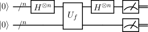
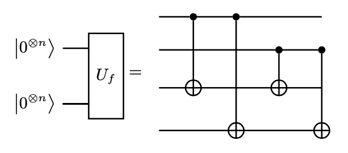

# Simon's algorithm - Benchmark Program

The Simon's algorithm [[1]](#references) is another example that a quantum algorithm can provide an exponential speedup over the classical algorithm on certain problem.

## Problem outline

Given a function $f:\left\{0,1\right\}^n\rightarrow\left\{0,1\right\}^n$ with the promise that, for some unknown $s\in\left\{0,1\right\}^n$, for all $x,y\in\left\{0,1\right\}^n$, 
$
f(x)=f(y)\quad \text{if and only if }\quad x\oplus y\in\left\{0,s\right\}.
$
In other word, if $s=0$, then $f(x)$ is a one-to-one function, whereas if $s\neq 0$, then $f(x)=f(x\oplus s)$ is a two-to-one function. The goal is to identify $s$ by making as few queries to $f(x)$ as possible

## Benchmarking
The Simon's algorithm is benchmarked by running `max_circuits` circuits for different hidden bitstrings `s`, chosen uniformly at random from  for  qubits. Each circuit is repeated a number of times denoted by `num_shots`. We then run the algorithm for numbers of qubits between `min_qubits` and `max_qubits`, inclusive. Note that both `min_qubits` and `max_qubits` are even integers.

The test returns the averages of the circuit creation times, average execution times, fidelities, and circuit depths, like all of the other algorithms. For this algorithm's fidelity calculation, as we always have a single correct state, we compare the returned measurements against the distribution that has the single state with 100% probability using our [noise-normalized fidelity calculation](../_doc/POLARIZATION_FIDELITY.md).

## Classical algorithm
Classically, to solve this prolbem one need to find two different inputs $x$ and $y$, if any, such that $f(x)=f(y)$. Since there are in total $2^n$ inputs, to have 100\% certainty, it requires to check up $2^{n-1}+1$ inputs. In fact, a classical algorithm would need at least $O(2^{n/2})$ queries of $f(x)$. 

## Quantum algorithm
Using a quantum algorithm, the problem can be solved with only one call to the oracle, implying a runtime of $O(n)$.
This requires $f$ to be implemented as a quantum
oracle. The quantum oracle for the function $f$ 
is a unitary $U_f$ that acts on a $n$ data qubits 
and $n$ ancilla qubit such that
$
U_f: |x\rangle|0^n\rangle\rightarrow|x\rangle|f(x)\rangle
$

### General Quantum Circuit
The following circuit is the general quantum circuit for Simons algorithm with $n$ data qubits
and $n$ ancilla qubits. 

   

*Fig 1. Diagram of general quantum circuit for Simon's Algorithm [[2]](#references)*

### Algorithmic Visualization

### Algorithm Steps

The steps for the Simon's algorithm are the following, with the state after each step, :

1. Initialize two quantum registers, which consist of $n$ data qubits and $n$ ancilla qubits, to $|0\rangle$.
$
|\psi_1\rangle = |0^n\rangle\otimes|0^n\rangle
$

2. Apply the Hadamard gate to the first register, which creates an equal superposition state in the first register
$
|\psi_2\rangle = \frac{1}{\sqrt{2^n}}\sum_{x=0}^{2^n-1}|x\rangle\otimes|0^n\rangle
$

3. Apply the oracle $U_f$ to the data and ancilla qubits, such that
$
|\psi_3\rangle = U_f|\psi_2\rangle = \frac{1}{\sqrt{2^n}}\sum_{x=0}^{2^n-1}|x\rangle\otimes|f(x)\rangle
$

4. Apply the Hadamard gate to the first register again such that

$
|\psi_4\rangle = \frac{1}{\sqrt{2^n}}\sum_{x=0}^{2^n-1}H|x\rangle\otimes|f(x)\rangle\\
= \sum_{y}^{2^n-1}\left(|y\rangle\otimes\frac{1}{{2^n}}\sum_{x}^{2^n-1}(-1)^{x\cdot y}|f(x)\rangle\right)
$
   
   
5. Measure all the qubits, and repeat for $O(n)$ times.

### Post processing
After the measurement results are obtained, we need to post process the data for two different cases.

1. Suppose we have $s=0$, then $f(x)$ is a one-to-one function such that
$
|\psi_4\rangle = \sum_{y}^{2^n-1}\left(|y\rangle\otimes\frac{1}{{2^n}}\sum_{x}^{2^n-1}(-1)^{x\cdot y}|x\rangle\right)
$
where we have assumed $f(x)=x$ up to some irrelevant permuation. Thus, the measurement will yield uniform distribution of all the possibilities, after $O(n)$ times of measurement. 

2. Suppose $b\neq0$, then $f(x)$ is a two-to-one function, and we can write
$
|\psi_4\rangle = \frac{1}{2^n}\sum_{x}\sum_{y=0}^{2^n-1}[(-1)^{x\cdot y}+(-1)^{\bar{x}\cdot y}]|y\rangle|f(x)\rangle 
$
where the summation $\sum_x$ runs over those numbers with different $f(x)$, and we  use $\bar{x}$ to denote $f(x)=f(\bar{x})$. Now the measurement will give a 2n-bit string, and let's focus that of the first register. In particular, a n-bit string $y$ will appear iff $x\cdot y=\bar{x}\cdot y \text{ mod } 2$ or $b\cdot y = 0 \text{ mod } 2$. As a result, if we perform the measurement $n$ times, we will have a set of equations 
$
b\cdot y_i \text{ mod }2, \quad i=1,...,n
$
for $n$ n-bit strings $y_i$. We can then solve $b$. This explains why Simon's algorithm solves the problem with $O(n)$ queries of $U_f$, which is exponentially faster than the classical algorithm.

## Gate Implementation

We illustrate how to implement $U_f$ for a given $s$. Suppose $s=0$, then $f(x)$ is a one-to-one function, and without loss of generality, we can assume $f(x)=x$. Thus $U_f$ consists of a transversal set of CX gates to copy $x$ from the first register to the second register. 
Further, for $s\neq 0$, then $f(x)$ is a two-to-one function. Let $ind_1$ denotes the first digit such that $s[ind_1]=1$. Then without loss of generality, $U_f$ is implementing "if $x[ind_1]=0$, return $x$, else return $x\oplus s$." 
For example, if $n=3$, and $s=11$, the $U_f$ can be constructed as following

   

*Fig 2. Example of $U_f$ for Simon's Algorithm.*

## Circuit Methods
This benchmark contains one method for generating the Simon's circuit, as described in the [General Quantum Circuit](#general-quantum-circuit) section. This method benchmarks the following circuit:

## References

[1] Daniel Simon (1997). On the Power of Quantum Computation [doi:10.1137/S0097539796298637](https://doi.org/10.1137%2FS0097539796298637)

[2] https://en.wikipedia.org/wiki/Simon%27s_problem

